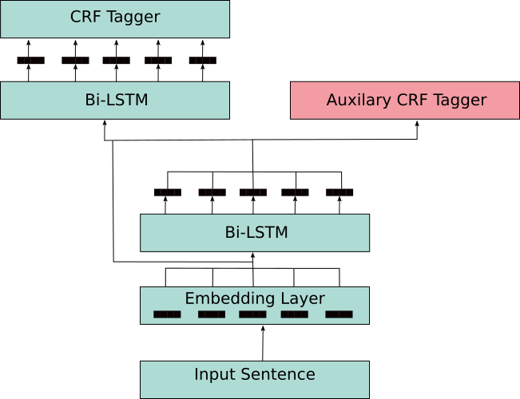
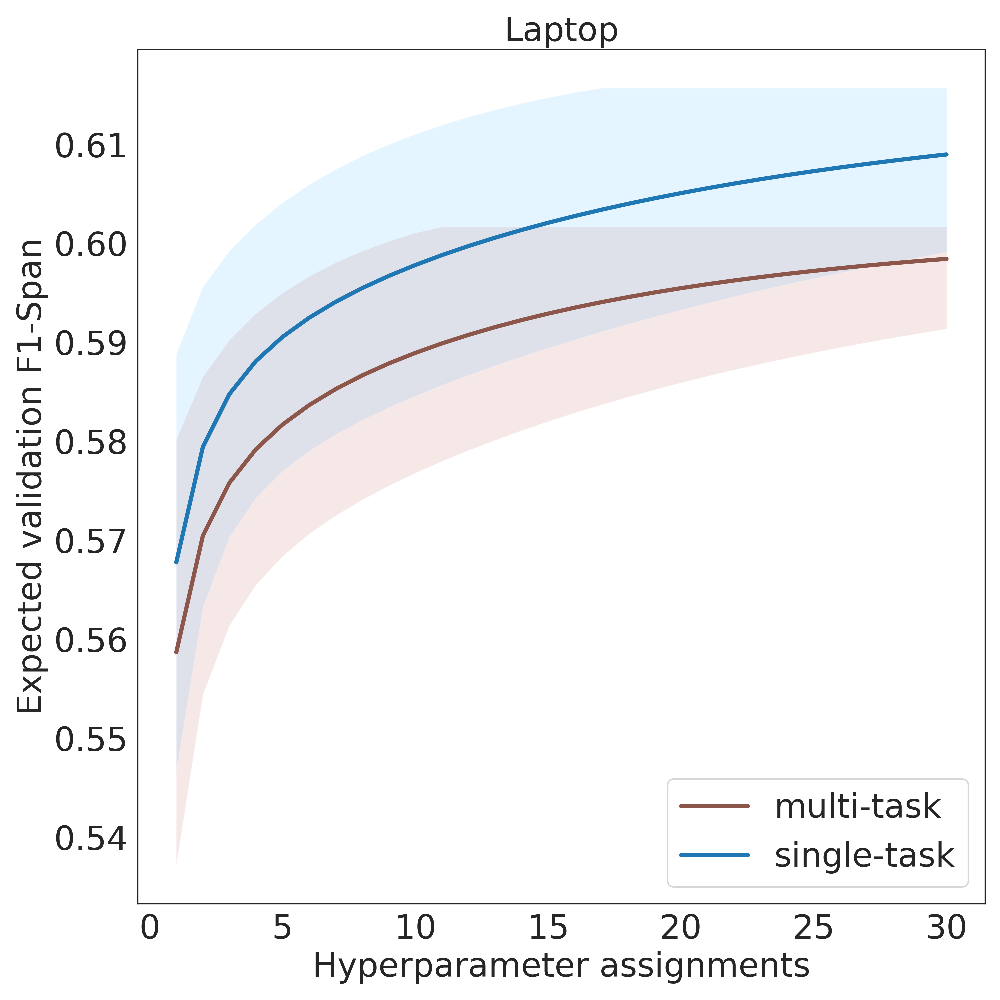

# Multi-task Learning of Negation and Speculation for Targeted Sentiment Classification

This repository contains the code, challenge datasets for negation and speculation for Targeted Sentiment Analysis (TSA), and links to the models created from the code described in following paper: [Multi-task Learning of Negation and Speculation for Targeted Sentiment Classification](https://aclanthology.org/2021.naacl-main.227/).

**Table of contents:**

1. [Paper Abstract](#paper-abstract)
2. [Installation/Requirements, Datasets, and Resources used](#installationrequirements-datasets-and-resources)
   1. [Install/Requirements](#installrequirements)
   2. [Datasets](#datasets)
      1. [Main train and evaluate datasets](#main-train-and-evaluate-datasets)
      2. [Negated and Speculative challenge datasets (evaluate only datasets)](#negated-and-speculative-challenge-datasets-evaluate-only-datasets)
      3. [Auxiliary datasets](#auxiliary-datasets)
    3. [Resources](#resources)
3. [Experiments](#experiments)
   1. [Hyperparameter tuning](#hyperparameter-tuning)
      1. [Multi Task Learning Tuning](#multi-task-learning-tuning)
      2. [Single Task Learning Tuning](#single-task-learning-tuning)
      3. [Plotting the expected validation score](#plotting-the-expected-validation-score)
   2. [Example of how to Train the Single-Task System using AllenNLP train command](#example-of-how-to-train-the-single-task-system-using-allennlp-train-command)
   3. [Example of how to Train the Multi-Task System using AllenNLP train command](#example-of-how-to-train-the-multi-task-system-using-allennlp-train-command)
   4. [Mass experiments setup](#mass-experiments-setup)
   5. [Predicting on the Negation Challenge corpus](#predicting-on-the-negation-challenge-corpus)
   6. [Predicting on the Speculation Challenge Corpus](#predicting-on-the-speculation-challenge-corpus)
   7. [Number of parameters](#number-of-parameters)
   8. [Inference time](#inference-time)
4. [Models](#models)
5. [Analysis/Notebooks](#analysisnotebooks)
6. [Acknowledgements](#acknowledgements)

## Paper Abstract

The majority of work in targeted sentiment analysis has concentrated on finding better methods to improve the overall results. Within this paper we show that these models are not robust to linguistic phenomena, specifically negation and speculation. In this paper, we propose a multi-task learning method to incorporate information from syntactic and semantic auxiliary tasks, including negation and speculation scope detection, to create English-language models that are more robust to these phenomena. Further we create two challenge datasets to evaluate model performance on negated and speculative samples. We find that multi-task models and transfer learning via language modelling can improve performance on these challenge datasets, but the overall performances indicate that there is still much room for improvement. We release both the datasets and the source code at [https://github.com/jerbarnes/multitask_negation_for_targeted_sentiment](https://github.com/jerbarnes/multitask_negation_for_targeted_sentiment).

## Installation/Requirements, Datasets, and Resources

### Install/Requirements

1. Python >= 3.6.1
2. Requires PyTorch version 1.2.0. This needs to be installed first and also depends on whether you would like to install the GPU or CPU version, see the following to install [Pytorch 1.2.0 and it's variants of GPU or CPU version.](https://pytorch.org/get-started/previous-versions/#v120)
2. `pip install -r requirements.txt`
3. `pip install .` 

If wanted to, run the tests:

`python -m pytest`

### Datasets

For more details on the datasets see [./dataset_readme.md](./dataset_readme.md).

#### Main train and evaluate datasets

The following TSA datasets were used for evaluation:

1. The SemEval 2014 Laptop dataset.
2. The combination of SemEval 2014, 2015, and 2016 Restaurant dataset.
3. The MAMS restaurant dataset from [Jiang et al. 2019](https://www.aclweb.org/anthology/D19-1654.pdf).
4. The MPQA dataset from [Wiebe et al. 2005](https://link.springer.com/article/10.1007/s10579-005-7880-9) in CONLL format which can be found within [./data/main_task/en/mpqa](./data/main_task/en/mpqa), split into train, development, and test splits.

The first two sentiment datasets are from [Li et al. 2019](https://www.aaai.org/ojs/index.php/AAAI/article/view/4643). The first three datasets can be downloaded and converted into CONLL format using the following script:
``` bash
python targeted_sentiment_downloader_converter.py
```
All of these datasets can be found in folders `laptop`, `restaurant`, `MAMS`, and `mpqa` within the [./data/main_task/en](./data/main_task/en) directory. We use the `BIOUL` format for all of these datasets.

An example of TSA task in `BIOUL` format (this example comes from the MAMS development split):
| The | basil | pepper | mojito | was | a | little | daunting | in | concept | , | but | I | was | refreshed | at | the | flavour | . |
|-----|-------|--------|--------|-----|---|--------|----------|----|---------|---|-----|---|-----|-----------|----|-----|---------|---|
| O   | B-NEG | I-NEG  | L-NEG  | O   | O | O      | O        | O  | O       | O | O   | O | O   | O         | O  | O   | U-POS   | O |

The dataset statistics for these four datasets can be seen below, split into train, development, and test splits. **NOTE** only the MPQA dataset contains the `BOTH` label. Furthermore the MPQA dataset within the data itself represents the labels as `positive`, `neutral`, `negative`, and `both` for the `POS`, `NEU`, `NEG`, and `BOTH` shown in the table below. The table below can be generated using the following script (script can also produce the table in `markdown`, `latex`, and without any options `pandas dataframe`):

`python data/main_task/en/sentiment_dataset_stats.py --main-datasets --to-html`

<table border="1" class="dataframe">
  <thead>
    <tr>
      <th></th>
      <th colspan="8" halign="left">train</th>
      <th colspan="8" halign="left">dev</th>
      <th colspan="8" halign="left">test</th>
    </tr>
    <tr>
      <th></th>
      <th>sents.</th>
      <th>targs.</th>
      <th>len.</th>
      <th>mult.</th>
      <th>POS</th>
      <th>NEU</th>
      <th>NEG</th>
      <th>BOTH</th>
      <th>sents.</th>
      <th>targs.</th>
      <th>len.</th>
      <th>mult.</th>
      <th>POS</th>
      <th>NEU</th>
      <th>NEG</th>
      <th>BOTH</th>
      <th>sents.</th>
      <th>targs.</th>
      <th>len.</th>
      <th>mult.</th>
      <th>POS</th>
      <th>NEU</th>
      <th>NEG</th>
      <th>BOTH</th>
    </tr>
    <tr>
      <th>dataset</th>
      <th></th>
      <th></th>
      <th></th>
      <th></th>
      <th></th>
      <th></th>
      <th></th>
      <th></th>
      <th></th>
      <th></th>
      <th></th>
      <th></th>
      <th></th>
      <th></th>
      <th></th>
      <th></th>
      <th></th>
      <th></th>
      <th></th>
      <th></th>
      <th></th>
      <th></th>
      <th></th>
      <th></th>
    </tr>
  </thead>
  <tbody>
    <tr>
      <th>laptop</th>
      <td>2741</td>
      <td>2044</td>
      <td>1.5</td>
      <td>136</td>
      <td>19.86</td>
      <td>43.20</td>
      <td>36.94</td>
      <td>0.00</td>
      <td>304</td>
      <td>256</td>
      <td>1.5</td>
      <td>18</td>
      <td>17.97</td>
      <td>40.62</td>
      <td>41.41</td>
      <td>0.0</td>
      <td>800</td>
      <td>634</td>
      <td>1.6</td>
      <td>38</td>
      <td>26.03</td>
      <td>53.47</td>
      <td>20.50</td>
      <td>0.0</td>
    </tr>
    <tr>
      <th>restaurant</th>
      <td>3490</td>
      <td>3896</td>
      <td>1.4</td>
      <td>312</td>
      <td>15.79</td>
      <td>60.04</td>
      <td>24.18</td>
      <td>0.00</td>
      <td>387</td>
      <td>414</td>
      <td>1.4</td>
      <td>34</td>
      <td>12.32</td>
      <td>65.22</td>
      <td>22.46</td>
      <td>0.0</td>
      <td>2158</td>
      <td>2288</td>
      <td>1.4</td>
      <td>136</td>
      <td>11.49</td>
      <td>66.61</td>
      <td>21.90</td>
      <td>0.0</td>
    </tr>
    <tr>
      <th>MAMS</th>
      <td>4297</td>
      <td>11162</td>
      <td>1.3</td>
      <td>4287</td>
      <td>45.06</td>
      <td>30.22</td>
      <td>24.72</td>
      <td>0.00</td>
      <td>500</td>
      <td>1329</td>
      <td>1.3</td>
      <td>498</td>
      <td>45.45</td>
      <td>30.25</td>
      <td>24.30</td>
      <td>0.0</td>
      <td>500</td>
      <td>1332</td>
      <td>1.3</td>
      <td>499</td>
      <td>45.50</td>
      <td>29.88</td>
      <td>24.62</td>
      <td>0.0</td>
    </tr>
    <tr>
      <th>mpqa</th>
      <td>4195</td>
      <td>1264</td>
      <td>6.3</td>
      <td>94</td>
      <td>13.29</td>
      <td>43.91</td>
      <td>39.08</td>
      <td>3.72</td>
      <td>1389</td>
      <td>400</td>
      <td>5.4</td>
      <td>29</td>
      <td>17.00</td>
      <td>42.50</td>
      <td>37.00</td>
      <td>3.5</td>
      <td>1620</td>
      <td>365</td>
      <td>6.7</td>
      <td>22</td>
      <td>19.18</td>
      <td>33.15</td>
      <td>41.37</td>
      <td>6.3</td>
    </tr>
  </tbody>
</table>


#### Negated and Speculative challenge datasets (evaluate only datasets)

The Development and Test splits for the negated and speculative only TSA datasets that have been annotated by one of the authors of this work can be found here:

1. Laptop<sub>*Neg*</sub> -- [Development](./data/main_task/en/laptop/dev_neg_only.conll), [Test](./data/main_task/en/laptop/test_neg_only.conll)
2. Laptop<sub>*Spec*</sub> -- [Development](./data/main_task/en/laptop/dev_spec_only.conll), [Test](./data/main_task/en/laptop/test_spec_only.conll)
3. Restaurant<sub>*Neg*</sub> -- [Development](./data/main_task/en/restaurant/dev_neg_only.conll), [Test](./data/main_task/en/restaurant/test_neg_only.conll)
4. Restaurant<sub>*Spec*</sub> -- [Development](./data/main_task/en/restaurant/dev_spec_only.conll), [Test](./data/main_task/en/restaurant/test_spec_only.conll)

Within these 4 datasets/splits only negated (*Neg*) or speculative (*Spec*) sentiments exist. All of the samples within these datasets have come from the development/test splits of the standard Laptop or Restaurant dataset and in cases have been changed so that the sentiment is either negated or speculative.

Below shows three sentences, the original, negated, and speculative. These sentences show case negated and speculative sentiment that is within these negated and speculative datasets. The tokens in **bold** are those that have been added to the original sentence, the target `sushi` is either positive (:smile:), negative (:disappointed:), or neutral (:expressionless:) in the original, negated, and speculative cases. 

| Type | Sentence | Sentiment towards `sushi` |
|------|----------|-----------|
| original | this is good, inexpensive sushi. | positive (:smile:) |
| negated | this is **not** good, inexpensive sushi. | negative (:disappointed:) |
|speculative | **I'm not sure if** this is good, inexpensive sushi. | neutral (:expressionless:) |


The dataset statistics for these negated and speculative TSA datasets can be seen below, split into development, and test splits. The table below can be generated using the following script (script can also produce the table in `markdown`, `latex`, and without any options `pandas dataframe`):

`python data/main_task/en/sentiment_dataset_stats.py --challenge-datasets --to-html`

<table border="1" class="dataframe">
  <thead>
    <tr>
      <th></th>
      <th colspan="8" halign="left">dev</th>
      <th colspan="8" halign="left">test</th>
    </tr>
    <tr>
      <th></th>
      <th>sents.</th>
      <th>targs.</th>
      <th>len.</th>
      <th>mult.</th>
      <th>POS</th>
      <th>NEU</th>
      <th>NEG</th>
      <th>BOTH</th>
      <th>sents.</th>
      <th>targs.</th>
      <th>len.</th>
      <th>mult.</th>
      <th>POS</th>
      <th>NEU</th>
      <th>NEG</th>
      <th>BOTH</th>
    </tr>
    <tr>
      <th>dataset</th>
      <th></th>
      <th></th>
      <th></th>
      <th></th>
      <th></th>
      <th></th>
      <th></th>
      <th></th>
      <th></th>
      <th></th>
      <th></th>
      <th></th>
      <th></th>
      <th></th>
      <th></th>
      <th></th>
    </tr>
  </thead>
  <tbody>
    <tr>
      <th>laptop_neg</th>
      <td>147</td>
      <td>181</td>
      <td>1.5</td>
      <td>41</td>
      <td>17.13</td>
      <td>47.51</td>
      <td>35.36</td>
      <td>0.0</td>
      <td>401</td>
      <td>464</td>
      <td>1.6</td>
      <td>79</td>
      <td>26.72</td>
      <td>50.00</td>
      <td>23.28</td>
      <td>0.0</td>
    </tr>
    <tr>
      <th>laptop_spec</th>
      <td>110</td>
      <td>142</td>
      <td>1.4</td>
      <td>10</td>
      <td>50.70</td>
      <td>33.10</td>
      <td>16.20</td>
      <td>0.0</td>
      <td>208</td>
      <td>220</td>
      <td>1.5</td>
      <td>19</td>
      <td>38.18</td>
      <td>41.36</td>
      <td>20.45</td>
      <td>0.0</td>
    </tr>
    <tr>
      <th>restaurant_neg</th>
      <td>198</td>
      <td>274</td>
      <td>1.4</td>
      <td>61</td>
      <td>16.42</td>
      <td>51.09</td>
      <td>32.48</td>
      <td>0.0</td>
      <td>818</td>
      <td>1013</td>
      <td>1.4</td>
      <td>161</td>
      <td>15.00</td>
      <td>52.81</td>
      <td>32.18</td>
      <td>0.0</td>
    </tr>
    <tr>
      <th>restaurant_spec</th>
      <td>138</td>
      <td>200</td>
      <td>1.3</td>
      <td>35</td>
      <td>30.00</td>
      <td>41.00</td>
      <td>29.00</td>
      <td>0.0</td>
      <td>400</td>
      <td>451</td>
      <td>1.4</td>
      <td>49</td>
      <td>16.85</td>
      <td>43.46</td>
      <td>39.69</td>
      <td>0.0</td>
    </tr>
  </tbody>
</table>

#### Auxiliary datasets

| Dataset     | Task       | Format | Split locations | 
|-------------|------------|--------|-----------------|
| (CD) [Conan Doyle](https://www.aclweb.org/anthology/S12-1035.pdf)        | Negation scope detection    | BIO CONLL format     | [Train](./data/auxiliary_tasks/en/conandoyle_train.conllu), [Development](data/auxiliary_tasks/en/conandoyle_dev.conllu), [Test](data/auxiliary_tasks/en/conandoyle_test.conllu)       |
| (SFU) [SFU review corpus](https://www.aclweb.org/anthology/L12-1298/)        | Negation scope detection | BIO CONLL format         | [Train](./data/auxiliary_tasks/en/conandoyle_train.conllu), [Development](data/auxiliary_tasks/en/conandoyle_dev.conllu), [Test](data/auxiliary_tasks/en/conandoyle_test.conllu)         |
| (SPEC) [SFU review corpus](https://www.aclweb.org/anthology/L12-1298/) | Speculation scope detection    | BIO CONLL format     | [Train](./data/auxiliary_tasks/en/SFU_train.conll), [Development](./data/auxiliary_tasks/en/SFU_dev.conll), [Test](./data/auxiliary_tasks/en/SFU_test.conll)       |
| (UPOS) [Streusle review corpus](https://www.aclweb.org/anthology/N15-1177.pdf) | Universal Part Of Speech (UPOS) tagging    | CONLL format     | [Train](./data/auxiliary_tasks/en/streusle.ud_train.conllulex), [Development](./data/auxiliary_tasks/en/streusle.ud_dev.conllulex), [Test](./data/auxiliary_tasks/en/streusle.ud_test.conllulex)       |
| (DR) [Streusle review corpus](https://www.aclweb.org/anthology/N15-1177.pdf) | Dependency Relation (DR) prediction    | CONLL format     | [Train](./data/auxiliary_tasks/en/streusle.ud_train.conllulex), [Development](./data/auxiliary_tasks/en/streusle.ud_dev.conllulex), [Test](./data/auxiliary_tasks/en/streusle.ud_test.conllulex)       |
| (LEX) [Streusle review corpus](https://www.aclweb.org/anthology/N15-1177.pdf) | Lexical analysis (LEX) prediction    | BIO (style) CONLL format     | [Train](./data/auxiliary_tasks/en/streusle.ud_train.conllulex), [Development](./data/auxiliary_tasks/en/streusle.ud_dev.conllulex), [Test](./data/auxiliary_tasks/en/streusle.ud_test.conllulex)       |

The SFU review corpus was split into 80%, 10%, and 10% train, development, and test splits respectively using the following script: `./scripts/sfu_data_splits.sh`. For more details on the complex task of lexical analysis (LEX) see point 19 from the following [README](https://github.com/nert-nlp/streusle/blob/master/CONLLULEX.md), which has come from the Streusle review corpus.

An example of all of the tasks can be seen in the table below:
|      | you       | might | not | like | the | service |
|------|-----------|-------|-----|------|-----|---------|
| CD | B<sub>*scope*</sub> | I<sub>*scope*</sub> | B<sub>*cue*</sub> | B<sub>*scope*</sub> | I<sub>*scope*</sub> | I<sub>*scope*</sub> | 
| SFU | B<sub>*scope*</sub> | I<sub>*scope*</sub> | B<sub>*cue*</sub> | B<sub>*scope*</sub> | I<sub>*scope*</sub> | I<sub>*scope*</sub> | 
| SPEC | B<sub>*scope*</sub> | B<sub>*cue*</sub> | B<sub>*scope*</sub> | I<sub>*scope*</sub> | I<sub>*scope*</sub> | I<sub>*scope*</sub> | 
| UPOS | PRON | AUX | PART | VERB | DET | NOUN |
| DR | nsubj | aux | advmod | root | det | obj | 
| LEX | O<sub>*PRON*</sub> | O<sub>*AUX*</sub> | O<sub>*ADV*</sub> | B<sub>*V-v.emotion*</sub> | O<sub>*DET*</sub> | B<sub>*N-n.ACT*</sub> | 


### Resources

All resources such as word embeddings (including Contextualised Word Representation (CWR) models) and AllenNLP model configurations are stored within [./resources](./resources).

1. All of the AllenNLP model configurations used for the main experiments can be found at: [./resources/model_configs](./resources/model_configs), the configurations used for hyperparameter tuning can be found at: [./resources/tuning/tuning_configs](./resources/tuning/tuning_configs), lastly the configurations used for getting some basic dataset statistics can be found at: [./resources/statistic_configs/en](./resources/statistic_configs/en).
2. All of the embeddings are **not** stored in this repository due to their size.
  * The [300D 840B token GloVe embedding](https://nlp.stanford.edu/projects/glove/), needs to be downloaded to the following path `./resources/embeddings/en/glove.840B.300d.txt`.
  * The standard [Transformer ELMo](https://www.aclweb.org/anthology/D18-1179.pdf) which was used as the CWR embedding for the **MPQA** dataset experiments can be downloaded from this [link](https://s3-us-west-2.amazonaws.com/allennlp/models/transformer-elmo-2019.01.10.tar.gz) and is to be downloaded to `./resources/embeddings/en/transformer-elmo-2019.01.10.tar.gz`
  * For the **MAMS** and **Restaurant** dataset CWR experiments the fine tuned Transformer ELMo was used and can be downloaded from [here](https://ucrel-web.lancs.ac.uk/moorea/research/multitask_negation_for_targeted_sentiment/resources/embeddings/en/restaurant_model.tar.gz) and is explained in more detail in this [repository](https://github.com/apmoore1/language-model) on how it was fine tuned to the Yelp restaurant review dataset. This model should be downloaded to `./resources/embeddings/en/restaurant_model.tar.gz`.
  * For the **Laptop** dataset CWR experiments the fine tuned Transformer ELMo was used and can be downloaded from [here](https://ucrel-web.lancs.ac.uk/moorea/research/multitask_negation_for_targeted_sentiment/resources/embeddings/en/laptop_model.tar.gz) and is explained in more detail in this [repository](https://github.com/apmoore1/language-model) on how it was fine tuned to the Amazon electronics review dataset. This model should be downloaded to `./resources/embeddings/en/laptop_model.tar.gz`.


## Experiments

Additional experiments can be found in the [./experiments_readme.md](experiments_readme.md).

We experiment with a single task baseline (STL) and a hierarchical multi-task model with a skip-connection (MTL), both of which can be seen in the Figure below. For the STL model, we first embed a sentence and then pass the embeddings to a Bidirectional LSTM (Bi-LSTM). These features are then concatenated to the input embeddings and fed to the second Bi-LSTM layer, ending with the token-wise sentiment predictions from the CRF tagger. For the MTL model, we additionally use the output of the first Bi-LSTM layer as features for the separate auxiliary task CRF tagger. As can be seen from the Figure below, the STL model and the MTL main task model use the same the green layers. The MTL additionally uses the pink layer for the auxiliary task. At inference time the MTL model is as efficient as STL, given that it only uses the green layers when predicting the targeted sentiment, of which this is empirically shown in the [inference time section.](#inference-time)



Before running any of the experiments for the single and multi task models we perform a hyperparameter search for both models. 

Also before running any of the code this bash command needs to be ran first, as [stanford-nlp](https://github.com/stanfordnlp/stanfordnlp) package is installed and due to [Ray](https://ray.readthedocs.io/en/latest/) that is used in [allentune](https://github.com/allenai/allentune), the `STANFORDNLP_TEST_HOME` environment variable has to be set before using `allentune` thus I did the following:

``` bash
export STANFORDNLP_TEST_HOME=~/stanfordnlp_test
```

### Hyperparameter tuning

We used the [allentune](https://github.com/allenai/allentune) package.

The tuning is performed on the smallest datasets which is the Laptop dataset for Main task (TSA) and the Conan Doyle (CD) for the Negation/Auxiliary task when tuning the multi and single task models. The parameters we tune for are the following:

1. Dropout rate - between 0 and 0.5
2. Hidden size for shared/first layer of the Bi-LSTM  - between 30 and 110
3. Starting learning rate for adam - between 0.01 (1e-2) and 0.0001 (1e-4)

The tuning is performed separately for the single and multi-task models. The single task model will only be tuned for the sentiment task and not the negation. Furthermore we tune the models by randomly sampling the parameters stated above within the range specified changing the random seed each time, of which these parameters are sampled 30 times in total for each model. From the 30 model runs the parameters from the best run based on the F1-Span/F1-i measure from the validation set are selected for all of the experiments for that model.

#### Multi Task Learning Tuning


Run the following:
``` bash
allentune search \
    --experiment-name multi_task_laptop_conan_search \
    --num-cpus 5 \
    --num-gpus 1 \
    --cpus-per-trial 5 \
    --gpus-per-trial 1 \
    --search-space resources/tuning/tuning_configs/multi_task_search_space.json \
    --num-samples 30 \
    --base-config resources/tuning/tuning_configs/multi_task_laptop_conan.jsonnet \
    --include-package multitask_negation_target
allentune report \
    --log-dir logs/multi_task_laptop_conan_search/ \
    --performance-metric best_validation_f1-measure-overall \
    --model multi-task
```

The multi-task model found the following as the best parameters from run number 24 with a validation F1-Span score of 60.17%:

1. lr = 0.0019
2. shared/first layer hidden size = 65
3. dropout = 0.27

#### Single Task Learning Tuning

Run the following:
``` bash
allentune search \
    --experiment-name single_task_laptop_search \
    --num-cpus 5 \
    --num-gpus 1 \
    --cpus-per-trial 5 \
    --gpus-per-trial 1 \
    --search-space resources/tuning/tuning_configs/single_task_search_space.json \
    --num-samples 30 \
    --base-config resources/tuning/tuning_configs/single_task_laptop.jsonnet \
    --include-package multitask_negation_target
allentune report \
    --log-dir logs/single_task_laptop_search/ \
    --performance-metric best_validation_f1-measure-overall \
    --model single-task
```

The single-task model found the following as the best parameters from run number 7 with a validation F1-Span score of 61.56%:

1. lr = 0.0015
2. shared/first layer hidden size = 60
3. dropout = 0.5

#### Plotting the expected validation score

To get a plot of the two STL and MTL models expected validation scores, you first have to copy the results from the [STL](./logs/single_task_laptop_search/results.jsonl) and [MTL](./logs/multi_task_laptop_conan_search/results.jsonl) together into a new file. Of which we have done this [here](./logs/other_result.jsonl). With this new combined file run the following to create the plot, which can be found [here](./resources/tuning/combined_tuning_laptop_performance.pdf) and the `PNG version is shown below`:
``` bash
allentune plot \
    --data-name Laptop \
    --subplots 1 1 \
    --figsize 10 10 \
    --plot-errorbar \
    --result-file logs/other_result.jsonl \
    --output-file resources/tuning/combined_tuning_laptop_performance.pdf \
    --performance-metric-field best_validation_f1-measure-overall \
    --performance-metric F1-Span
```


### Example of how to Train the Single-Task System using AllenNLP train command

You can use the allennlp train command here:
``` bash
allennlp train resources/model_configs/targeted_sentiment_laptop_baseline.jsonnet -s /tmp/any --include-package multitask_negation_target
```

### Example of how to Train the Multi-Task System using AllenNLP train command

You can use the allennlp train command here:
``` bash
allennlp train resources/model_configs/multi_task_trainer.jsonnet -s /tmp/any --include-package multitask_negation_target
```

### Mass experiments setup

**In all experiments the embedding whether that is GloVe or CWR is frozen as in the embedding layer(s) does not get tuned during training.**. This can be changed within the model configurations.

The previous two subsections describe how to just train one model on one dataset, in the [paper](https://aclanthology.org/2021.naacl-main.227/) we trained each model 5 times and there were numerous models (1 STL and 6 MTL) and 4 datasets. Thus to do this we created two scripts. The first script trains a model e.g. STL on one dataset 5 times and then saves the 5 models including the respective auxiliary task models where applicable and also saves the result. The second script runs the first script across all of the models and datasets.

The first python script has the following argument signature:
1. Model config file path
2. Main task test data file path
3. Main task development/validation data file path
4. Folder to save the results too. This folder will contain two files a `test.conll` and `dev.conll` each of these files will contain the predicted results for the associated data split. The files will have the following structure: `Token#GOLD_Label#Predicted_Label_1#Predicted_Label_2`. Where the `#` indicates whitespace and the number of predicted labels is determined by the number of times the model has been ran.
5. Number of times to run the model -- in all of our experiments we run the model 5 times thus this is always 5 in our case.
6. Folder to save the trained model(s) too. If you are training an MTL model then the auxiliary task model(s) will also be saved here.
7. OPTIONAL FLAG `--mtl` is required if you are training an MTL model.
8. OPTIONAL FLAG `--aux_name` the name of auxilary task is required if training an MTL model. By default this is `negation` but if a `negation` task is not being trained than the name of the task from the model config is required e.g. for u_pos the task name is `task_u_pos` thus you remove the `task_` to get the `aux_name` which in this case is `u_pos`.

And an example of running this script is shown below, whereby this runs the STL model with GloVe embeddings 5 times on the Laptop dataset:

``` bash
python ./scripts/train_and_generate.py ./resources/model_configs/stl/en/laptop.jsonnet ./data/main_task/en/laptop/test.conll ./data/main_task/en/laptop/dev.conll ./data/results/en/stl/laptop 5 ./data/models/en/stl/laptop
```

The MTL models can be run in a similar way but does require a few extra flags. Thus the example below shows the MTL (UPOS) model run 5 times with CWR embedding on the MAMS dataset:

``` bash
python ./scripts/train_and_generate.py ./resources/model_configs/mtl/en/u_pos/mams_contextualized.jsonnet ./data/main_task/en/MAMS/test.conll ./data/main_task/en/MAMS/dev.conll ./data/results/en/mtl/u_pos/MAMS_contextualized 5 ./data/models/en/mtl/u_pos/MAMS_contextualized --mtl --aux_name upos
```

The second python script which trains all of the models and makes the predictions for the standard datasets is this script (this does not make predictions on the negated or speculative TSA datasets):

``` bash
./run_all.sh
```


### Predicting on the Negation Challenge corpus

These are the *Neg* datasets from the [Negated and Speculative challenge datasets (evaluate only datasets) section](#negated-and-speculative-challenge-datasets-evaluate-only-datasets)

``` bash
./scripts/generate_negation_only_predictions.sh
```


### Predicting on the Speculation Challenge Corpus

These are the *Spec* datasets from the [Negated and Speculative challenge datasets (evaluate only datasets) section](#negated-and-speculative-challenge-datasets-evaluate-only-datasets)

``` bash
./scripts/generate_spec_only_predictions.sh
```

### Number of parameters

(We assume that all of the models are stored in the following directory `./data/models`, see the [Models](#models) section for more details on how to download the trained models.)

To find the statistics for the number of parameters in the different models run:

``` bash
python number_parameters.py
```

### Inference time

(We assume that all of the models are stored in the following directory `./data/models`, see the [Models](#models) section for more details on how to download the trained models.)

This tests the inference time for the following models after they have been loaded into memory:

1. [STL GloVe](http://ucrel-web.lancs.ac.uk/moorea/research/multitask_negation_for_targeted_sentiment/models/en/stl/laptop/)
2. [STL CWR](http://ucrel-web.lancs.ac.uk/moorea/research/multitask_negation_for_targeted_sentiment/models/en/stl/laptop_contextualized/)
3. [MTL SFU GloVe](http://ucrel-web.lancs.ac.uk/moorea/research/multitask_negation_for_targeted_sentiment/models/en/mtl/sfu/laptop/)
4. [MTL SFU CWR](http://ucrel-web.lancs.ac.uk/moorea/research/multitask_negation_for_targeted_sentiment/models/en/mtl/sfu/laptop_contextualized/)

**NOTE** If you go to any of the model links we use `model_0.tar.gz`

Both of the models will have been trained on the Laptop dataset. Additionally the links associated to the models above will take you to the location where you can download those models. The inference times will be tested on the Laptop test dataset which contains 800 sentences. Further the models will be tested on the following hardware:

1. GPU - GeForce GTX 1060 6GB
2. CPU - AMD Ryzen 5 1600

And with the following batch sizes:

1. 1
2. 8
3. 16
4. 32

The computer also had 16GB of RAM. Additional the computer will run the model 5 times and time each run and report the minimum and maximum run times. Minimum times are recommended by the [python timeit library](https://docs.python.org/3/library/timeit.html) and maximum is reported to show the potential distribution.

To run these inference time testing run the following:
``` bash
python inference_time.py
```

It will print out a Latex table of results, which when converted to markdown look like the following:

| Embedding | Model | Batch Size | Device | Min Time | Max Time |
| --------- | ----- | ---------- | ------ | -------- | -------- |
| GloVe     | STL   | 1          | CPU    |    10.24 |  10.45   |
| GloVe     | STL   | 8          | CPU    |    7.00  |  7.21    |
| GloVe     | STL   | 16         | CPU    |    6.67  |  6.91    |
| GloVe     | STL   | 32         | CPU    |    6.35  |  6.51    |
| GloVe     | MTL   | 1          | CPU    |    10.06 |  10.26   |
| GloVe     | MTL   | 8          | CPU    |    7.05  |  7.19    |
| GloVe     | MTL   | 16         | CPU    |    6.90  |  6.99    |
| GloVe     | MTL   | 32         | CPU    |    6.41  |  6.46    |
| GloVe     | STL   | 1          | GPU    |    9.24  |  9.26    |
| GloVe     | STL   | 8          | GPU    |    6.58  |  6.67    |
| GloVe     | STL   | 16         | GPU    |    6.34  |  6.36    |
| GloVe     | STL   | 32         | GPU    |    6.12  |  6.26    |
| GloVe     | MTL   | 1          | GPU    |    9.43  |  9.49    |
| GloVe     | MTL   | 8          | GPU    |    6.60  |  6.70    |
| GloVe     | MTL   | 16         | GPU    |    6.26  |  6.55    |
| GloVe     | MTL   | 32         | GPU    |    6.10  |  6.20    |
| CWR       | STL   | 1          | CPU    |    64.79 | 71.26    |
| CWR       | STL   | 8          | CPU    |    43.62 | 49.70    |
| CWR       | STL   | 16         | CPU    |    47.06 | 48.41    |
| CWR       | STL   | 32         | CPU    |    56.76 | 62.77    |
| CWR       | MTL   | 1          | CPU    |    64.01 | 67.90    |
| CWR       | MTL   | 8          | CPU    |    49.05 | 50.00    |
| CWR       | MTL   | 16         | CPU    |    53.74 | 56.42    |
| CWR       | MTL   | 32         | CPU    |    55.33 | 55.79    |
| CWR       | STL   | 1          | GPU    |    23.26 | 23.79    |
| CWR       | STL   | 8          | GPU    |    8.82  | 9.09     |
| CWR       | STL   | 16         | GPU    |    8.57  | 8.86     |
| CWR       | STL   | 32         | GPU    |    8.45  | 9.78     |
| CWR       | MTL   | 1          | GPU    |    23.81 | 23.97    |
| CWR       | MTL   | 8          | GPU    |    9.19  | 9.49     |
| CWR       | MTL   | 16         | GPU    |    8.54  | 8.92     |
| CWR       | MTL   | 32         | GPU    |    8.43  | 8.70     |

Also this data is stored in the following file [./inference_save.json](./inference_save.json)

## Models

All of the models from the [Mass experiments setup section](#mass-experiments-setup), which are all of the models that were created from the experiments that are declared in the [paper](https://aclanthology.org/2021.naacl-main.227/) can be found at [https://ucrel-web.lancs.ac.uk/moorea/research/multitask_negation_for_targeted_sentiment/models/en/](https://ucrel-web.lancs.ac.uk/moorea/research/multitask_negation_for_targeted_sentiment/models/en/). These models are saved as AllenNLP models and [can be load, using `load_archive`, as shown in the documentation](https://docs.allennlp.org/v1.1.0/api/models/archival/#load_archive). An example of loading a model, in python (assuming you have saved a model to `./data/models/en/stl/laptop_contextualized/model_0.tar.gz`):

``` python
from pathlib import Path
from allennlp.models.archival import load_archive

cuda_device = -1 # 0 for GPU -1 for CPU
model_path = Path('./data/models/en/stl/laptop_contextualized/model_0.tar.gz')
loaded_model = load_archive(str(model_path.resolve()), cuda_device=cuda_device)
```

A script that shows how to load the model and make predictions so that the model can be used to benchmark inference time is the [./inference_time.py](./inference_time.py) script.

The [link](https://ucrel-web.lancs.ac.uk/moorea/research/multitask_negation_for_targeted_sentiment/models/en/) sends you to a page with the Single task models in one folder with the following folder structure:

`stl/DATASET_NAME_EMBEDDING/model_RUN_NUMBER.tar.gz`

Whereby `DATASET_NAME` can be, which refer to the 4 [Main train and evaluate datasets](#main-train-and-evaluate-datasets):

1. MAMS
2. laptop
3. mpqa
4. restaurant

`EMBEDDING` is either an empty string for the GloVe embedding or `_contextualized` for the CWR that matches the relevant `DATASET_NAME` see the [Resources section.](#resources)

`RUN_NUMBER` can be `0`, `1`, `2`, `3`, or `4` which represents the five different runs for each experiment. An example path to the STL model trained on the MAMS dataset using the GloVe embeddings and was the 2nd trained model:

`stl/MAMS/model_1.tar.gz`

The multi task models have the following structure:

`mtl/AUXILIARY_DATASET/DATASET_NAME_EMBEDDING/model_RUN_NUMBER.tar.gz`

Whereby `AUXILIARY_DATASET` is the auxiliary task that the model was also trained on, which can be that refer to the 6 [Auxiliary datasets](#auxiliary-datasets):

1. conan_doyle
2. dr
3. lextag
4. sfu
5. sfu_spec
6. u_pos

An example path to the MTL model trained on the MAMS dataset, with auxiliary task of speculation prediction, using a CWR and was the 1st trained model:

`mtl/sfu_spec/MAMS_contextualized/model_0.tar.gz`

Also in each of these folders also contains the saved auxiliary task model which in this examples will be saved as:

`mtl/sfu_spec/MAMS_contextualized/task_speculation_model_0.tar.gz`

## Analysis/Notebooks

The notebooks [./notebooks](./notebooks) (all notebooks can be loaded using Google Colab) store all of the evaluation results which generate the tables within the [paper](https://aclanthology.org/2021.naacl-main.227/) and run/produce the statistical significance test results that are within those tables in the [paper](https://aclanthology.org/2021.naacl-main.227/).

The results on the 4 main datasets: Laptop, Restaurant, MAMS, and MPQA see the [./notebooks/Main_Evaluation.ipynb](./notebooks/Main_Evaluation.ipynb) notebook.

The results on the Laptop and Restaurant negation and speculation challenge datasets, that was created from this work, see the [./notebooks/Negation_Evaluation.ipynb](./notebooks/Negation_Evaluation.ipynb) and [./notebooks/Speculation_Evaluation.ipynb](./notebooks/Speculation_Evaluation.ipynb) notebooks. 

## Acknowledgements

This work has been carried out as part of the [SANT project (Sentiment Analysis for Norwegian Text)](https://www.mn.uio.no/ifi/english/research/projects/sant/), funded by the Research Council of Norway (grant number 270908). Andrew has been funded by Lancaster University by an EPSRC Doctoral Training Grant. The authors thank the [UCREL research centre](http://ucrel.lancs.ac.uk/) for hosting the models created from this research. 
